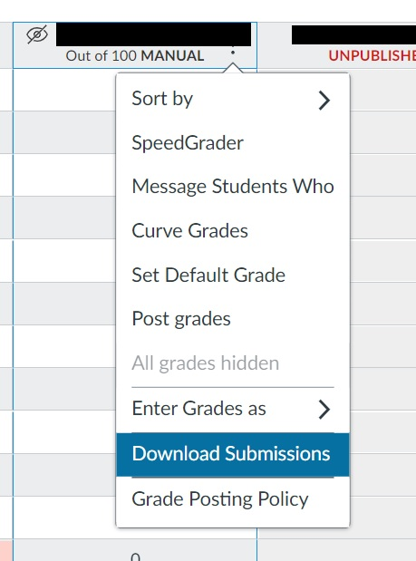
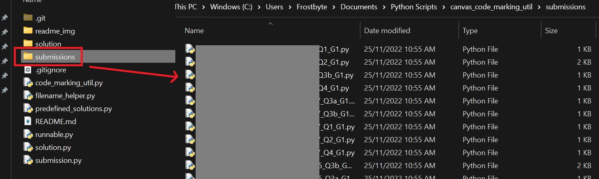
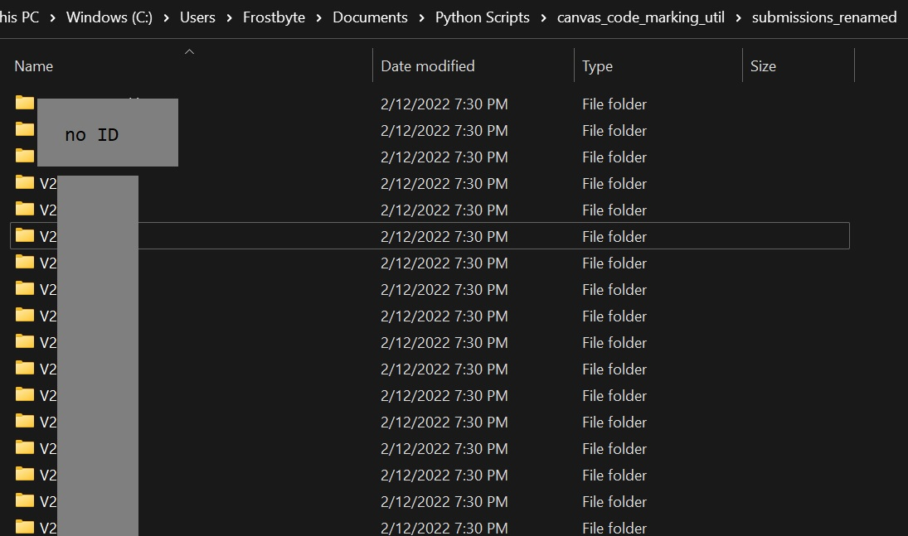
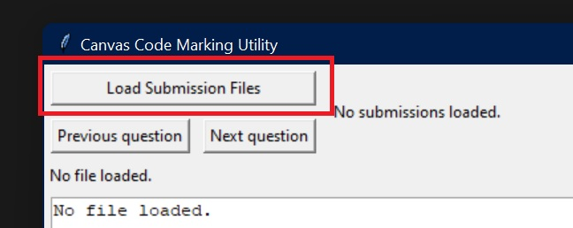
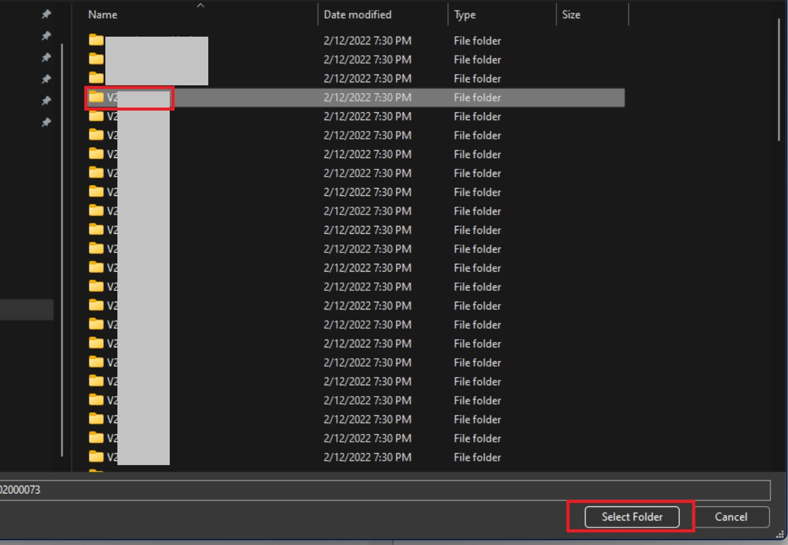
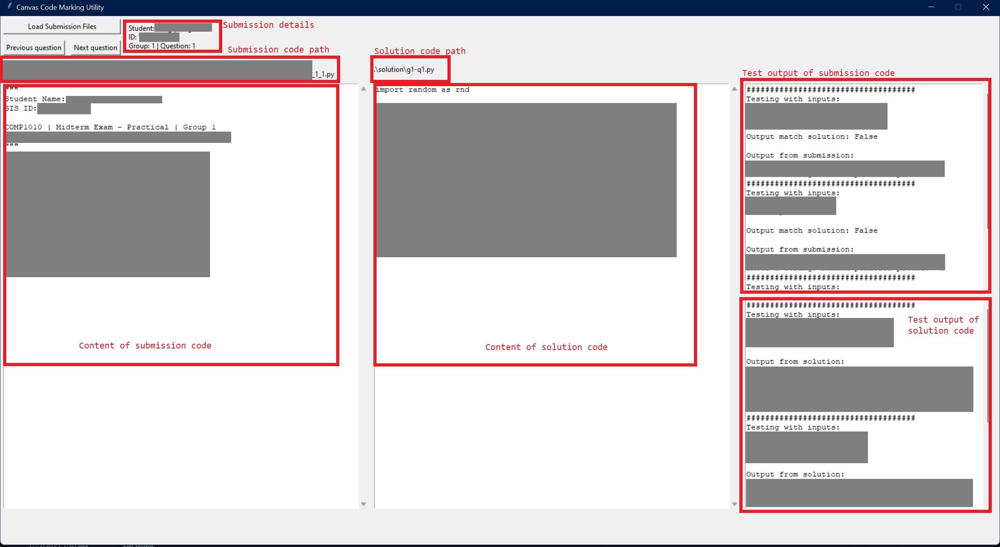

# Canvas Code Marking Utility
Python utility script to help with marking process of Canvas CMS-submitted Python files.

# Dependencies
This repo will work with must Python 3.4+ environments and only requires 1 external Python package to be installed:
```pip install func-timeout```

# How to Use
## Prepare submission data
The program was designed with submission data downloaded from Canvas LMS with `Download Submissions` functionality from the `Gradebook`.



After downloading, the submissions should be stored in a `.zip` file with each submission having the following naming format:
```studentfullname_[CanvasStudentID]_[CanvasSubmissionID]_SubmissionFileName.extension```

Extract the content of the `.zip` file into a directory called `submissions`. This directory should now have all the `.py` file submissions in the same place. 


## Cleaning submission data names with FilenameHelper
After you have extracted the submissions in to a folder called `submissions`, you can run the `filename_helper.py` file to generated a cleaned up version of the submissions.

```py ./filename_helper.py```

If you want to change the path to the `submissions` directory, edit the `SRC_DIR` variable in `filename_helper.py`.

After the cleaning is complete, you should now have a folder called `submissions_renamed` (or your own directory if you modified `NEW_DIR`).


The program assumes that student have named their file according to the following format before uploading:
```StudentID_Q[questionnumber]_G[groupnumber].py```

If your desired naming format is different, please modify `clean_submission_filename()`, `get_filename_parts`, `rename_file` and `create_submission` accordingly.

## Using Code Marking Utility
After the submissions are renamed to the proper format, it can immediately be used with the GUI utility.
Start the GUI by running the `code_marking_util.py` module.
```py ./code_marking_util.py```

Start by clicking on `Load Submission Files`:


Find and select the directory containing a students' submission files - which should have been created by `FilenameHelper`:


The code has now been loaded, and if it works, the content and test output of the submitted code and the solution will be displayed.



